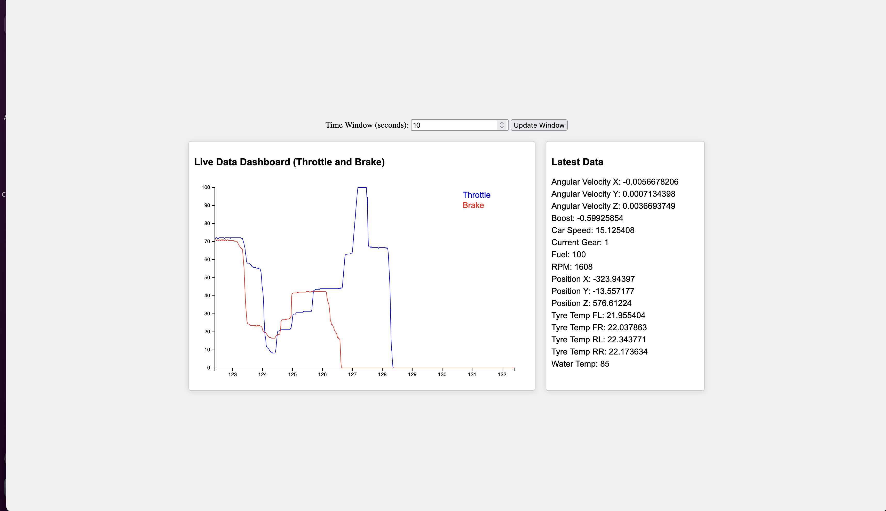
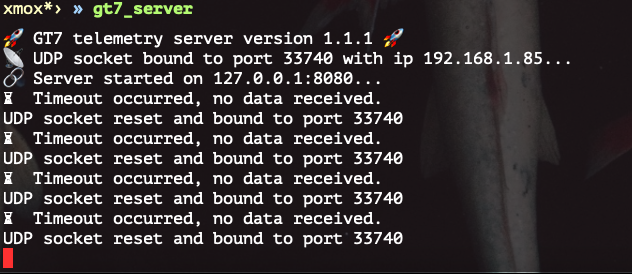

# GT7 Telemetry Server

GT7 Telemetry Server is a server that listens for data from a GT7 UDP socket server and broadcasts decrypted data to a WebSocket server for easy consumption by a frontend.

## Installation

You can either use the install script from the release section or download the binary and run it manually.

## Todo

- [ ] Add option to send data to InfluxDB for consumption by Grafana

## Dashboard

This is a basic example of a dashboard that can be used to visualize the data output by the telemetry server.

### Example

Run the telemetry server.

```
cargo run
```

Run basic python server in the example folder to visualize data.

```
python -m http.server 8080
```

Access the dashboard at `http://localhost:8080`.



## Usage

```
gt7_server <playstation_ip: Default 192.168.1.85> <websocket_port: Default 8080>
```



## References

This project was inspired by the work of others https://www.gtplanet.net/forum/threads/gt7-is-compatible-with-motion-rig.410728 and people like Bornhall, Nenkai, Stoobert and more.
